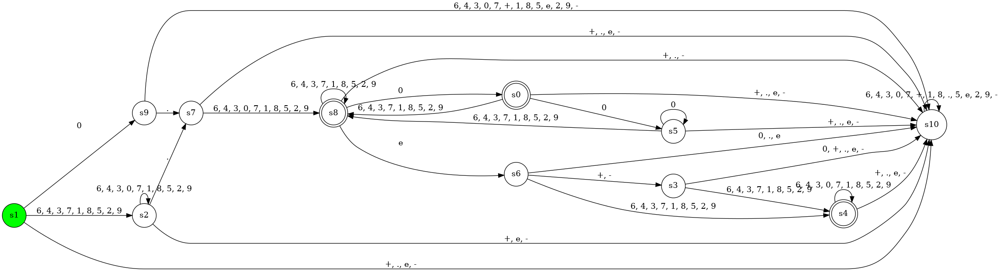
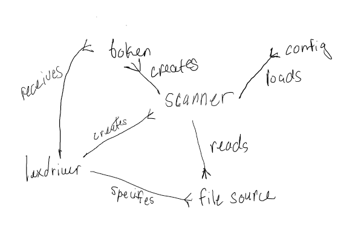
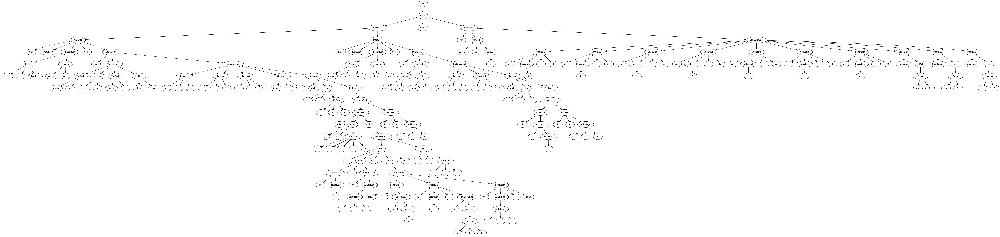
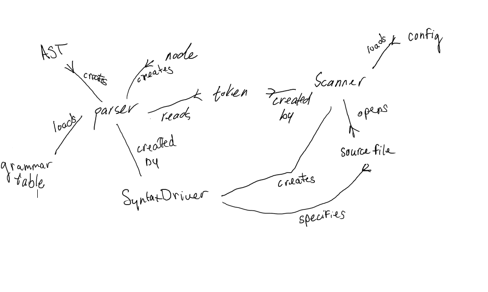

# Compiling Another Random Program (CARP)


CARP is a compiler written in Python. It is simple, intuitive, and customizable. CARP can be configured to accept any language or pattern. 


## Dependencies

- Python 3.7+
- Pandas
- Pydot


## Lexical Analyzer 

### Configuration File

1. Run a text editor on `lex.conf`:
```shell
vim lex.conf
```

2. Add or remove token-regex pairs in tokens:
```shell
tokens = [('token1': 'regex'),
          ('token2': '\.html')]
```

3. Add or remove reserved keywords in reserved:
```shell
reserved = {'hello',
            'world', 
            'if', 
            'else'}
```


### Command Line Arguments

```shell
lexdriver.py <file> [config]

    <file>:
        Source code file ending with the extension .src
    [config]:
        Segment of program containing the tokens and regular expressions
        
        Must contain variables "reserved" and "tokens", where:
            type(reserved) -> list(str(phrase))
            type(tokens) -> list(tuple(str(id), str(regex))
```

### Regular Expressions


The following regular expressions supported by default in LexMe:
```regexp
digit:
 [0-9]
nonzero:
 [1-9]
letter:
 [a-zA-Z]
alphanum:
 [0-9A-Za-z_]
 [{digit}{letter}_]
character:
 [0-9a-zA-Z_ ]
 [{alphanum}_]
id: 
 [a-zA-Z][0-9a-zA-Z_]*
 {letter}{alphanum}* 
intnum
 [1-9][0-9]* | 0
 ({nonzero}{digit}*)|0 
fraction 
 [.]([0-9]*[1-9] | 0) 
 [.]({digit}*nonzero | 0)
floatnum
 ([1-9][0-9]* | 0)([.]([0-9]*[1-9] | 0))(e[+-]?([1-9][0-9]* | 0))?
 {integer}{fraction}(e[+-]?{integer})?
stringlit
 "[0-9a-zA-Z_ ]*"
 "{character}*"
inline_comment:
 //.*
block_comment:
 /[*](?:.|\s)*?[*]/' 

```

### Finite State Machine

A lexical analyzer utilizing finite state machines would convert the previously mentioned regular expressions into their posix
notation and produce the corresponding minimum DFA in the automata library. The final finite state machine is a unification of all
sub finite state machines. The figures below show the DFA representations of the 'while' reserved word, the float, and the
entire lexical specification respectively. Other images may be viewed in the 'img' folder.





The regular expressions for operators and reserved words have been omitted in this document since they are trivial.

### Design Details

The lex library contains the scanner and token structures. The former reads the input character by character once the contents
of the input file stream have been stored in a buffer. If a match is found, the scanner generates a token structure and yields
its execution until the next call.

Additionally, the scanner requires a config file to generate the logic for matching lexemes to tokens.
The file is assumed to be correct in structure and logic. It is then executed using a python exec() call. We note that the config
file is a fragment of a program, whose purpose is to allow customizations to the current specifications.

The follow figure shows the relation between each object:



## Syntax Analyzer


### Configuration File

1. Run a text editor on `grammar.conf`:
```shell
vim grammar.conf
```

2. Add, edit, or remove entries into the file:
```shell
Expr -> ArithExpr Expr2 .
Expr2 -> RelOp ArithExpr .
```

**Note**: Terminals are represented in lower case, while non-terminals start with an upper case. Refer to [ucalgary](https://smlweb.cpsc.ucalgary.ca/) for more information on the format. 

Adding an extra character (or number) in non-terminal expressions flattens the entire expression as if it were a continuation of the original statement.

For example, the previous expression's tree structure would normally be represented as:

```shell
Expr
|---- ArithExpr
|---- Expr2
       |---- RelOp
       |---- ArithExpr
 
```

However, LexMe merges non-terminal names that have a difference of one character at the end:

```shell
Expr
|---- ArithExpr
|---- RelOp
|---- ArithExpr
```

### Command Line Arguments

The directories have been hard coded in the main function for testing purposes. A future version of the driver will be provided with this feature.

For now, use:

```shell
syntaxdriver.py
```

### Rules and Formats

The following rules are supported by default in LexMe:
```text
<START>        ::= <prog>
<prog>         ::=   'main' <funcBody>
<classDecl>    ::= 'class' 'id' [['inherits' 'id' {{',' 'id'}}]] '{'  '}' ';'
<visibility>   ::= 'public' | 'private' | EPSILON
<memberDecl>   ::= <funcDecl> | <varDecl>  
<funcDecl>     ::= 'func' 'id' '(' <fParams> ')' ':' <type> ';' 
                |  'func' 'id' '(' <fParams> ')' ':' 'void' ';' 
<funcHead>     ::= 'func' [['id' 'sr']] 'id' '(' <fParams> ')' ':' <type> 
                |  'func' [['id' 'sr']] 'id' '(' <fParams> ')' ':' 'void'
<funcDef>      ::= <funcHead> <funcBody> 
<funcBody>     ::= [[ 'var' '{'  '}' ]] 
<varDecl>      ::= <type> 'id'  ';'
<statement>    ::= <assignStat> ';'
                |  'if'     '(' <relExpr> ')' 'then' <statBlock> 'else' <statBlock> ';'
                |  'while'  '(' <relExpr> ')' <statBlock> ';'
                |  'read'   '(' <variable> ')' ';'
                |  'write'  '(' <expr> ')' ';'
                |  'return' '(' <expr> ')' ';'
                |  'break' ';'
                |  'continue' '; '
                |  <functionCall> ';'
<assignStat>   ::= <variable> <assignOp> <expr>
<statBlock>    ::= '{'  '}' | <statement> | EPSILON  
<expr>         ::= <arithExpr> | <relExpr>
<relExpr>      ::= <arithExpr> <relOp> <arithExpr>
<arithExpr>    ::= <arithExpr> <addOp> <term> | <term> 
<sign>         ::= '+' | '-'
<term>         ::= <term> <multOp> <factor> | <factor>
<factor>       ::= <variable>
                |  <functionCall>
                |  'intLit' | 'floatLit' | 'stringLit' 
                |  '(' <arithExpr> ')'
                |  'not' <factor>
                |  <sign> <factor>
                |  'qm' '[' <expr> ':' <expr> ':' <expr> ']' 
<variable>     ::=  'id' 
<functionCall> ::=  'id' '(' <aParams> ')'
<idnest>       ::= 'id'  '.'
                |  'id' '(' <aParams> ')' '.'
<indice>       ::= '[' <arithExpr> ']'
<arraySize>    ::= '[' 'intNum' ']' | '[' ']'
<type>         ::= 'integer' | 'float' | 'string' | 'id'
<fParams>      ::= <type> 'id'   | EPSILON  
<aParams>      ::= <expr>  | EPSILON 
<fParamsTail>  ::= ',' <type> 'id' 
<aParamsTail>  ::= ',' <expr>
<assignOp>     ::= '='
<relOp>        ::= 'eq' | 'neq' | 'lt' | 'gt' | 'leq' | 'geq' 
<addOp>        ::= '+' | '-'
<multOp>       ::= '*' | '/'
```

### Abstract Syntax Tree (AST)

The syntax library produces a concrete tree, which is then converted to an abstract tree by removing
, amount other things, epsilon transitions and duds in the grammar. Duds are entries which do not affect the structure of
the grammar itself. This includes any parentheses (square, flower, or regular) and commas or dots. These characters are 
omitted during the production of the tree as they function to group expressions and are not needed in an LL1 parser.

Furthermore, the abstract tree omits moving operators such as those defined in 'relOp' since we do not make the assumption that
these characters are always a representation of a binary operator. For example, the '-' character in 'addOp' is binary, whereas
that same character is unary in 'Factor'. 

The following figure is the ast representation after running the syntax analyzer on a non-erroneous version of `examples/bubblesort.src`:



### Design Details

The syntax library contains three structures: node, parser, ast. The node structure maintains information about the lexeme and
the order of the tokens with which they were seen. The parser structure takes in a scanner object and creates nodes bound to the
tokens output by the scanner. To recover from errors, the parser runs the ['panic mode'](http://www.cs.ecu.edu/karl/5220/spr16/Notes/Bison/error.html)
sub-routine. The parser's results are stored within the object itself and is accessible publicly. Then, the ast structure is instantiated
and called to operate on the parser to simplify the structure. We did not merge the ast and parser structures as we felt it would add
additional cluttering of thoughts and ideas presented in the code. Thus, we sacrifice performance for readability.




## Tools

### Automata (PyPi)

The [Automata](https://github.com/caleb531/automata) library contains datastructures and logic for converting NFAs to DFAs using Thompson's Construction Algorithm and
Rabin-Scott's Powerset Algorithm. A newer version of automata adds the ability to render the finite automata using PyDot.

### re

Python's well-developed [re](https://docs.python.org/3/library/re.html) library provides the capabilities to construct and customize tokens from regular expressions
and output the results for each character that is read. The lex library implemented in this project leverages the features present
in the re library to implement a simple parser and tokenizer.

### Shunting Algorithm

The [shunting](https://en.wikipedia.org/wiki/Shunting-yard_algorithm) algorithm, although not necessarily a tool, was very useful throughout the project as it was used to convert
regular expressions into their posix notation during the construction of the finite automata.

### UCalgary

[Ucalgary's](https://smlweb.cpsc.ucalgary.ca/) grammar tool was used to verify that the generated grammar in `grammar.conf` fulfilled LL1 conditions.

### AtoCC

The [AtoCC](http://www.atocc.de/cgi-bin/atocc/site.cgi?lang=de&site=main) software was used to test and validate that the grammar defined in `grammar.conf` was outputting the proper results.


## Contributors

[Rani Rafid](github.com/ra-ni) - 26975852
