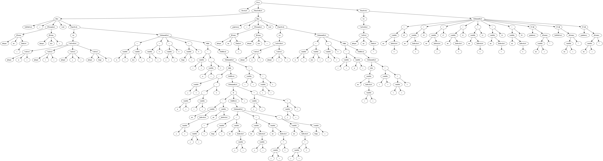

# Compiling Another Random Program (CARP)


CARP is a compiler written in Python. It is simple, intuitive, and customizable. CARP can be configured to accept any language or pattern. 


## Dependencies

- Python 3.7+
- Pandas
- Pydot


## Lexical Analyzer 

### Configuration File

1. Run a text editor on `lex.conf`:
```shell
vim lex.conf
```

2. Add or remove token-regex pairs in tokens:
```shell
tokens = [('token1': 'regex'),
          ('token2': '\.html')]
```

3. Add or remove reserved keywords in reserved:
```shell
reserved = {'hello',
            'world', 
            'if', 
            'else'}
```


### Command Line Arguments

```shell
lexdriver.py <file>

    <file>:
        Source code file ending with the extension .src
```

### Regular Expressions


The following regular expressions supported by default in LexMe:
```regexp
digit:
 [0-9]
nonzero:
 [1-9]
letter:
 [a-zA-Z]
alphanum:
 [0-9A-Za-z_]
 [{digit}{letter}_]
character:
 [0-9a-zA-Z_ ]
 [{alphanum}_]
id: 
 [a-zA-Z][0-9a-zA-Z_]*
 {letter}{alphanum}* 
intnum
 [1-9][0-9]* | 0
 ({nonzero}{digit}*)|0 
fraction 
 [.]([0-9]*[1-9] | 0) 
 [.]({digit}*nonzero | 0)
floatnum
 ([1-9][0-9]* | 0)([.]([0-9]*[1-9] | 0))(e[+-]?([1-9][0-9]* | 0))?
 {integer}{fraction}(e[+-]?{integer})?
stringlit
 "[0-9a-zA-Z_ ]*"
 "{character}*"
inline_comment:
 //.*
block_comment:
 /[*](?:.|\s)*?[*]/' 

```

### Finite State Machine

A lexical analyzer utilizing finite state machines would convert the previously mentioned regular expressions into their posix
notation and produce the corresponding minimum DFA in the automata library. The final finite state machine is a unification of all
sub finite state machines. The figures below show the DFA representations of the 'while' reserved word, the float, and the
entire lexical specification respectively. Other images may be viewed in the 'img' folder.


The regular expressions for operators and reserved words have been omitted in this document since they are trivial.

### Design Details

The lex library contains the scanner and token structures. The former reads the input character by character once the contents
of the input file stream have been stored in a buffer. If a match is found, the scanner generates a token structure and yields
its execution until the next call.

Additionally, the scanner requires a config file to generate the logic for matching lexemes to tokens.
The file is assumed to be correct in structure and logic. It is then executed using a python exec() call. We note that the config
file is a fragment of a program, whose purpose is to allow customizations to the current specifications.

The follow figure shows the relation between each object:


## Syntax Analyzer


### Configuration File

1. Run a text editor on `grammar.conf`:
```shell
vim grammar.conf
```

2. Add, edit, or remove entries into the file


```shell
Start -> Prog .
Prog -> NEW_Prog ClassList UNARY FuncDefList UNARY main FuncBody UNARY .

ClassList -> NEW_ClassList ClassList2 .
ClassList2 -> ClassDecl UNARY ClassList2
	| .
ClassDecl -> class PUSH id PUSH UNARY InheritList UNARY lcurbr MembList UNARY rcurbr semi .
```

### Command Line Arguments

```shell
syntaxdriver.py <file>

    <file>:
        Source code file ending with the extension .src
```

### Rules and Formats

The following rules are supported by default in LexMe:
```text
<START>        ::= <prog>
<prog>         ::=   'main' <funcBody>
<classDecl>    ::= 'class' 'id' [['inherits' 'id' {{',' 'id'}}]] '{'  '}' ';'
<visibility>   ::= 'public' | 'private' | EPSILON
<memberDecl>   ::= <funcDecl> | <varDecl>  
<funcDecl>     ::= 'func' 'id' '(' <fParams> ')' ':' <type> ';' 
                |  'func' 'id' '(' <fParams> ')' ':' 'void' ';' 
<funcHead>     ::= 'func' [['id' 'sr']] 'id' '(' <fParams> ')' ':' <type> 
                |  'func' [['id' 'sr']] 'id' '(' <fParams> ')' ':' 'void'
<funcDef>      ::= <funcHead> <funcBody> 
<funcBody>     ::= [[ 'var' '{'  '}' ]] 
<varDecl>      ::= <type> 'id'  ';'
<statement>    ::= <assignStat> ';'
                |  'if'     '(' <relExpr> ')' 'then' <statBlock> 'else' <statBlock> ';'
                |  'while'  '(' <relExpr> ')' <statBlock> ';'
                |  'read'   '(' <variable> ')' ';'
                |  'write'  '(' <expr> ')' ';'
                |  'return' '(' <expr> ')' ';'
                |  'break' ';'
                |  'continue' '; '
                |  <functionCall> ';'
<assignStat>   ::= <variable> <assignOp> <expr>
<statBlock>    ::= '{'  '}' | <statement> | EPSILON  
<expr>         ::= <arithExpr> | <relExpr>
<relExpr>      ::= <arithExpr> <relOp> <arithExpr>
<arithExpr>    ::= <arithExpr> <addOp> <term> | <term> 
<sign>         ::= '+' | '-'
<term>         ::= <term> <multOp> <factor> | <factor>
<factor>       ::= <variable>
                |  <functionCall>
                |  'intLit' | 'floatLit' | 'stringLit' 
                |  '(' <arithExpr> ')'
                |  'not' <factor>
                |  <sign> <factor>
                |  'qm' '[' <expr> ':' <expr> ':' <expr> ']' 
<variable>     ::=  'id' 
<functionCall> ::=  'id' '(' <aParams> ')'
<idnest>       ::= 'id'  '.'
                |  'id' '(' <aParams> ')' '.'
<indice>       ::= '[' <arithExpr> ']'
<arraySize>    ::= '[' 'intNum' ']' | '[' ']'
<type>         ::= 'integer' | 'float' | 'string' | 'id'
<fParams>      ::= <type> 'id'   | EPSILON  
<aParams>      ::= <expr>  | EPSILON 
<fParamsTail>  ::= ',' <type> 'id' 
<aParamsTail>  ::= ',' <expr>
<assignOp>     ::= '='
<relOp>        ::= 'eq' | 'neq' | 'lt' | 'gt' | 'leq' | 'geq' 
<addOp>        ::= '+' | '-'
<multOp>       ::= '*' | '/'
```

### Abstract Syntax Tree (AST)

The syntax library contains operators which are defined within the library itself. The user can simply edit the order of the operators in
```_config/grammar.conf``` if they wish to change the behavior of the program for the production of the abstract syntax tree. Some operators include:

1. **PUSH**: Creates a node labelled by the previous terminal and pushes it onto the stack:
```shell
Type -> integer PUSH
	| float PUSH
	| string PUSH
	| id PUSH .
```

2. **UNARY**: Pops two nodes from the stack and makes the second popped node the parent of the other. Pushes it back onto the stack:
```shell
Factor -> not PUSH Factor UNARY .
```

3. **BIN**: Pops three nodes from the stack and makes the middle node the parent of the others. Pushes it back onto the stack:
```shell
Example -> 1 PUSH assign PUSH 2 PUSH BIN .
```

4. **NOP**: Pushes an ε (epsilon) labelled node onto the stack:
```shell
Intnum -> intnum PUSH
	| NOP .
```

5. **NEW_X**: Pushes a new node labelled 'X' onto the stack:
```shell
ClassList -> NEW_ClassList ClassList2 .
```

6. **CHK**: If the node at the top of the stack has no children, re-labels the node as ε (epsilon):
```shell
DimList -> NEW_DimList DimList2 CHK .
```

Using the default rules in the grammar configuration file, we can construct a tree for a non-erroneous versions of ```examples/polynomial.src``` and
```examples/bubblesort.src```: 




### Design Details

The syntax library uses objects defined in the scanner library to produce an abstract tree. It relies on the rules defined in
the configuration file (see ```/_config/grammar.conf```). The parsing table from the grammar is either constructed during run-time
or loaded from disk. This decision is made by comparing the modification times of the configuration file and the compressed table files.
If the modification time is later, then the compressed table files must be updated. A query is sent to Ucalgary's website containing the grammar
as the payload. The response is then parsed using Pandas and the table is stored locally for future use. When modifying the grammar, it is important to note
that the modifications must adhere to the rules defined by the Ucalgary online tool (otherwise it will result in errors).

The parser object generates an abstract syntax tree only if such a tree can be constructed from the stack. Otherwise, the tree is simply
empty.  


## Symantec Analyzer


### Configuration File

The configuration file is based in ```grammar.conf```, where new commands were added to simplify the abstract tree creation

### Command Line Arguments

```shell
symantecdriver.py <file>

    <file>:
        Source code file ending with the extension .src
```

### Symantec Tree

The symantec library contains operators which are defined within the library itself. The user can simply edit the order of the operators in
```_config/grammar.conf``` if they wish to change the behavior of the program for the production of the abstract syntax tree. Some operators include:

1. **SWAP**: Swaps the topmost node in the stack with the second topmost node:
```shell
DataMember -> Visibility MemberDecl SWAP MAP_visibility_kind .
```

2. **CUNARY**: Conditional UNARY operator. Applies UNARY only if the node is not an epsilon node, else pops it from stack:
```shell
FuncBody -> lcurbr NEW_body LocalDecls StatementList CUNARY rcurbr .

LocalDecls -> var NEW_group lcurbr VarDeclList rcurbr CUNARY
    | .
```

3. **APP_X**: Pops the topmost node from the stack. Then, appends to the contents of the new topmost stack the value stored in the previous topmost node with key of X:
```shell
VarDecl -> NEW KIND_variable Type AS_type id PUSH AS_name IFS BEGIN DimList END IFS_default APP_type .
# This would append the node containing the dimensions into the node id using key 'type'
```
4. **MAP_X_Y**: Pops the topmost node from the stack and gets the contents C of the node matching key Y. Then, appends C into the new topmost node using key X:
```shell
DataMember -> Visibility MemberDecl SWAP MAP_visibility_kind .
# Maps the contents C of 'kind' from the top node. Pops it. Then, adds C to the new topmost node using key 'visibility'
```

5. **AS_X**: Pops the topmost node from the stack. Then adds its contents C to the new topmost node using key X as the identifier:
```shell
VarDecl -> NEW KIND_variable Type AS_type id PUSH AS_name IFS BEGIN DimList END IFS_default APP_type .
# Type is pushed onto stack with contents C, which is one of 'integer', 'float', 'string' or 'id'. The contents C is then stored in node NEW using key 'type'

ClassDecl -> class NEW KIND_class id PUSH AS_name InheritList lcurbr NEW_group MembList CUNARY rcurbr semi .
MemberDecl -> func NEW KIND_function id PUSH AS_name FuncDecl semi
	| VarDecl semi .
```

6. **IFS_X**: The internal field separator of the program. When called, the value of IFS is stored for future use with BEGIN/END statements. If X is not defined, then IFS is an empty string. The default IFS value is ```,```:
```shell
VarDecl -> NEW KIND_variable Type AS_type id PUSH AS_name IFS BEGIN DimList END IFS_default APP_type .
# IFS changes the value to ''
FuncDef -> func PUSH KIND_function IFS_sr BEGIN id PUSH ScopeSpec END IFS_default AS_name FuncDecl FuncBody .
# IFS_sr changes the value to '::'
FuncDef -> func PUSH KIND_function IFS_sr BEGIN id PUSH ScopeSpec END IFS_default AS_name FuncDecl FuncBody .
# IFS_default changes the value to ','. Any other IFS value not defined also changes it to ','

```

7. **UPD_X_Y**: Updates the contents of the topmost node, C, corresponding to key X to Y. Contents do not need to exist for them to be udpated:
```shell
Sign -> Sign2 PUSH UPD_kind_sign .
# Changes the contents in kind to sign
RelOp -> RelOp2 PUSH UPD_kind_relop .
# Changes the contents in kind to relop
```

8. **X_Y**: If commands have not been specifically set, then define the default X_Y option to be the insert operation. Inserts key X with content Y into the topmost node of the stack:
```shell
VarDecl -> NEW KIND_variable Type AS_type id PUSH AS_name IFS BEGIN DimList END IFS_default APP_type .
# Creates new content 'variable' using key 'kind'

MemberDecl -> func NEW KIND_function id PUSH AS_name FuncDecl semi
	| VarDecl semi .
# Creates new content 'function' using key 'kind'
```


Using the default rules in the grammar configuration file, we can obtain the following trees: 


### Design Details

The symantec library includes two stages: the pre-processing and the post-processing stages. In the pre-processing stage, the tree
is refined by removing, modifying, and merging nodes of specific kinds. For example, a node defined to have a kind of group
will check for duplication amongst the nodes before merging them together into a table. Additionally, this step checks for
issues with inheritance (such as cyclic inheritance), function calls on non-existent functions, and overriding or overloading
issues.

In contrast to the first stage, the second stage checks for nodes defined within a body (or definition). Each node is mapped to its type in a bottom-up
manner, and checks are made to ensure consistency amongst variables or classes, their types, and their visibility.

These two stages are executed sequentially, and the result is stored as an image. Issues detected during this phase are immediately reported.

The following shows the results after running both phases on ```polynomial_correct.src```:


## Tools

### Automata (PyPi)

The [Automata](https://github.com/caleb531/automata) library contains datastructures and logic for converting NFAs to DFAs using Thompson's Construction Algorithm and
Rabin-Scott's Powerset Algorithm. A newer version of automata adds the ability to render the finite automata using PyDot.

### re

Python's well-developed [re](https://docs.python.org/3/library/re.html) library provides the capabilities to construct and customize tokens from regular expressions
and output the results for each character that is read. The lex library implemented in this project leverages the features present
in the re library to implement a simple parser and tokenizer.

### Shunting Algorithm

The [shunting](https://en.wikipedia.org/wiki/Shunting-yard_algorithm) algorithm, although not necessarily a tool, was very useful throughout the project as it was used to convert
regular expressions into their posix notation during the construction of the finite automata.

### UCalgary

[Ucalgary's](https://smlweb.cpsc.ucalgary.ca/) grammar tool was used to verify that the generated grammar in `grammar.conf` fulfilled LL1 conditions.

### AtoCC

The [AtoCC](http://www.atocc.de/cgi-bin/atocc/site.cgi?lang=de&site=main) software was used to test and validate that the grammar defined in `grammar.conf` was outputting the proper results.


## Contributors

[Rani Rafid](github.com/ra-ni) - 26975852
